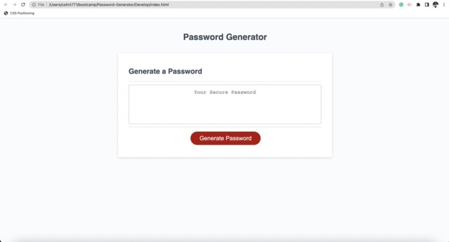

# Password Generator

## Description

This project consisted of utilzing JavaScript to create a password generator that outputs a password containing between 8 and 128 characters consisting of upper case letters, lower case letters, numbers, and special characters. The length of the password and the characters it contains depend on your answers to the prompts that the code generates.

## Installation

N/A

## Usage

To use this password generator, follow this link: (https://colint771.github.io/Password-Generator/)

## Credits

N/A

## License

Please refer to the LICENSE in the repo
